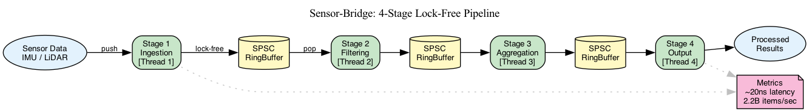

# sensor-bridge

<div align="center">

[](https://crates.io/crates/sensor-bridge)
[](https://docs.rs/sensor-bridge)
[](https://github.com/huecodes/sensor-bridge/actions/workflows/ci.yml)
[](https://github.com/huecodes/sensor-bridge/blob/main/LICENSE)
[](https://www.rust-lang.org/)

**Lock-free sensor processing pipeline for robotics**

4-stage pipeline · SPSC ring buffers · **2.2B items/sec** · **~20ns latency**

Real sensors too — feed it UDP or TCP JSON packets from an ESP32, a
lab rig, or the included [Python mock sender](scripts/mock_udp_sender.py),
and watch live data flow through the pipeline in seconds. See
[`examples/udp_demo.rs`](examples/udp_demo.rs).

</div>

---

<p align="center">
  
</p>

## Features

- **Lock-free SPSC** — Wait-free ring buffers with cache-line padding, no mutexes in the hot path
- **4-stage pipeline** — Ingestion → Filter → Aggregation → Output, each on its own thread
- **Zero-copy** — `ObjectPool`, `BufferPool`, and `Arc`-based `SharedData` minimize allocations
- **Adaptive backpressure** — Block, drop, or sample strategies with a hysteresis controller
- **Rich metrics** — HDR latency histograms, jitter tracking, per-stage dashboards
- **`no_std`-compatible core** — buffer, error, sensor, and stage modules compile without `std`

## Performance

| Metric | Result |
|--------|--------|
| Pipeline throughput | >1M items/sec |
| Stage processing | 2.2B items/sec |
| Channel latency | ~20ns |
| Ring buffer push | 0.3ns |
| Ring buffer pop | 9ns |

Numbers from `cargo bench` on an Apple M-series chip. Your results may vary.

## Quick Start

```toml
[dependencies]
sensor-bridge = "0.1"
```

```rust,no_run
use sensor_bridge::pipeline::{MultiStagePipelineBuilder, PipelineConfig};
use sensor_bridge::stage::{Filter, Identity, Map};
use std::time::Duration;

let mut pipeline = MultiStagePipelineBuilder::<i32, i32, _, _, _, _>::new()
    .config(PipelineConfig::default().channel_capacity(1024))
    .ingestion(Map::new(|x: i32| x + 1))       // normalize
    .filtering(Filter::new(|x: &i32| *x > 0))  // drop negatives
    .aggregation(Map::new(|x: i32| x * 2))      // scale
    .output(Identity::new())                     // pass through
    .build();

pipeline.send(5).unwrap();
std::thread::sleep(Duration::from_millis(10));

if let Some(result) = pipeline.try_recv() {
    println!("result: {result}"); // 12
}

pipeline.shutdown();
pipeline.join().unwrap();
```

## Installation

```toml
[dependencies]
# Full standard-library build (channels, metrics, pipeline):
sensor-bridge = "0.1"

# no_std core only (buffer, error, sensor, stage):
sensor-bridge = { version = "0.1", default-features = false }
```

## Examples

| Example | Description |
|---------|-------------|
| [`simple_imu`](examples/simple_imu.rs) | Hello-world: mock IMU → ring buffer → moving-average filter |
| [`multi_sensor`](examples/multi_sensor.rs) | IMU + barometer fusion with timestamp synchronisation |
| [`full_pipeline`](examples/full_pipeline.rs) | All 4 stages, realistic sensor data, throughput report |
| [`metrics_demo`](examples/metrics_demo.rs) | Live dashboard, latency percentiles, performance targets |
| [`benchmark_latency`](examples/benchmark_latency.rs) | End-to-end latency measurement across scenarios |
| [`imu_fusion`](examples/imu_fusion.rs) | Complementary filter on simulated MPU-6050 with RMSE vs truth |
| [`udp_demo`](examples/udp_demo.rs) | Live UDP sensor → 4-stage pipeline → stats dashboard (feature = network) |

```bash
cargo run --example simple_imu
cargo run --example multi_sensor
cargo run --example full_pipeline
cargo run --example metrics_demo
cargo run --example benchmark_latency --release
cargo run --example imu_fusion
# In two shells:
cargo run --features network --example udp_demo -- --bind 127.0.0.1:9000
python3 scripts/mock_udp_sender.py --target 127.0.0.1:9000
```

## CLI

```bash
cargo run --features cli -- demo            # python mock + pipeline + stats
cargo run --features cli -- listen          # UDP ingest, stream stats
cargo run --features cli -- record --output data.csv
cargo run --features cli -- replay --input data.csv
cargo run --features cli -- bench --items 1000000 --release
```

## Benchmarks

```bash
# Full suite with HTML reports in target/criterion/
cargo bench

# Quick compile/run smoke-check
cargo bench -- --test
```

Benchmark groups: `ring_buffer_*`, `stage_processing`, `pipeline_chain`, `channels/*`, `allocations/*`.

## Architecture

```text
Producer thread(s)
       │
       ▼
 ┌─────────────┐     ┌────────────┐     ┌─────────────┐     ┌────────────┐
 │  Ingestion  │────▶│  Filtering │────▶│ Aggregation │────▶│   Output   │
 │  (thread 1) │     │  (thread 2)│     │  (thread 3) │     │  (thread 4)│
 └─────────────┘     └────────────┘     └─────────────┘     └────────────┘
       │                    │                   │                   │
   bounded                bounded            bounded             bounded
   channel                channel            channel             channel
                                                                     │
                                                                     ▼
                                                              Consumer thread(s)
```

Each stage runs its own thread and communicates via `crossbeam` bounded channels.
The `MultiStagePipelineBuilder` wires everything together and manages lifetimes.

For single-threaded use, `PipelineBuilder` + `PipelineRunner` give a composable
zero-copy pipeline with `map`, `filter`, and `then` combinators.

## Contributing

Contributions are welcome! Please read [CONTRIBUTING.md](CONTRIBUTING.md) for:
- How to run tests and benchmarks
- Clippy / fmt requirements
- PR process and commit message style

## License

Licensed under either of:
- MIT license (`LICENSE`)
- [Apache License, Version 2.0](https://www.apache.org/licenses/LICENSE-2.0)

at your option.
